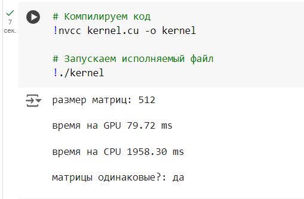
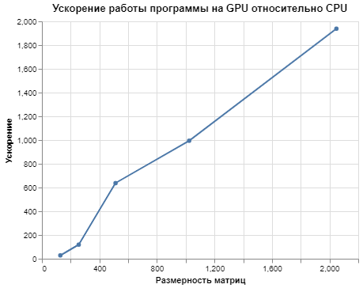

# Лабораторная работа №1 
### Задача
Реализовать алгоритм перемножения матриц.  
Задача: реализовать алгоритм перемножения матриц  
Язык: C++ или Python.  
Входные данные: 2 матрицы размером от 100х100 до 2000х2000 каждая.
Выходные данные: проверка корректности перемножения + время вычисления.  

Реализация должна содержать 2 функции перемножения матриц: на CPU и на GPU с применением CUDA.  
#### Выбор Google Colab для работы
Гугл колаб был выбран альтернативой, потому что на компьютере, на котором производились вычисления, нет куды

#### Описание работы программы
В программе происходит перемножение двух квадратных матриц размерности matrix_size×matrix_size, заполненные случайными числами.
Согласно заданию перемножение происходит на CPU и на GPU, замеряется время выполнения перемножения, выполняется проверка вычислений.
Пример работы программы представлен ниже:

#### Функции:
filling_matrices - заполнение матриц matrix_1 и matrix_2 случайными числами.
matrix_multiplication_GPU - перемножение матриц на девайсе(GPU).
matrix_multiplication_CPU - перемножение матриц на(CPU).
is_equal - сравнение двух результирующих матриц, вычисленных на CPU и GPU.
 
#### Результаты
Ниже приведена таблица времени работы параллельной и последовательной функций для различных размерностей матрицы. 
Время указано в миллисекундах.

Размерность матриц, sizeMatrix | Время работы на GPU, мс | Время работы на CPU, мс | Ускорение
:----:|:-------:|:-----------:|------:
128 | 0,39 | 10,96 | 28,10
256 | 0,71 | 84,24 | 118,65
512 | 2,84 | 1808,94 | 636,95
1024 | 11,90 | 11830,79 | 994,18
2048 | 72,23 | 139993,84 | 1938,17

##### График ускорения
График ускорения представлен ниже:

Можно сделать вывод, что время работы функции, которая выполняется на GPU, растёт гораздо быстрее при увеличении размерности матрицы.
По графику ускорения видно, что программа, написанная на CUDA, дает значительный выигрыш во времени при решении задачи нахождения произведения квадратных матриц. 
