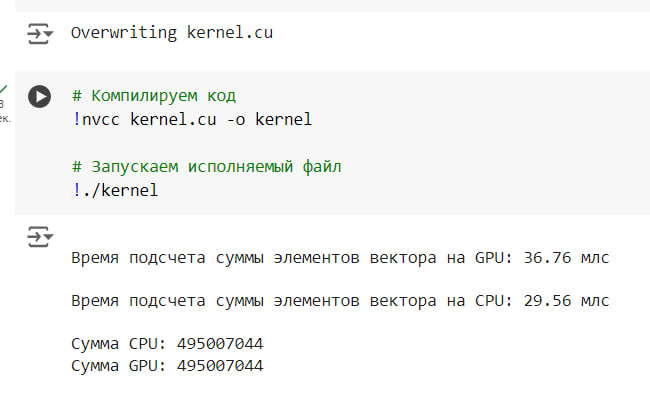
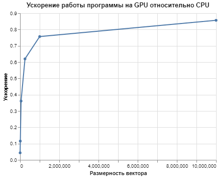

# Лабораторная работа №1 
### Задача
Реализовать алгоритм перемножения матриц.  
Задача: реализовать алгоритм сложения элементов вектора
Язык: C++ или Python
Входные данные: Вектор размером 1 000..1 000 000 значений.
Выходные данные: сумма элементов вектора + время вычисления
Реализация должна содержать 2 функции сложения элементов вектора: на CPU и на
GPU с применением CUDA.

#### Выбор Google Colab для работы
Гугл колаб был выбран альтернативой, потому что на компьютере, на котором производились вычисления, нет куды

#### Описание работы программы
Функция sum_calculating_gpu отвечает за вычисление суммы элементов вектора на GPU. 
Для сохранения промежуточных результатов создан массив с разделяемой памятью shared_array[]. 
Затем идет вычисление номера нити и получение частичной суммы путем сложения элементов с индексом, равным индексу нити, а затем добавление размерности блока. Это позволяет использовать только один блок для вычислений и избежать ошибок доступа к данным. После этого происходит синхронизация нитей, чтобы избежать ошибок с доступом к данным.
Далее, используя принцип редукции, происходит сложение полученных промежуточных сумм. Сначала складываются каждые две последовательно идущие ячейки, затем происходит синхронизация, и в следующей итерации складываются результаты предыдущей итерации и так далее. Итоговый результат остается в ячейке shArray[0], и значение этой ячейки выводится нулевой нитью.

Функция sum_calculating_cpu выполняет последовательное сложение элементов вектора.

#### Функции:
filling_matrices - заполнение матриц matrix_1 и matrix_2 случайными числами.
matrix_multiplication_GPU - перемножение матриц на девайсе(GPU).
matrix_multiplication_CPU - перемножение матриц на(CPU).
is_equal - сравнение двух результирующих матриц, вычисленных на CPU и GPU.
 
#### Результаты
Ниже приведена таблица времени работы параллельной и последовательной функций для различных размерностей векторов. Время указано в миллисекундах и получено как среднее по 10 запускам.

Размерность , N | Время работы на GPU, мс | Время работы на CPU, мс | Ускорение
:----:|:-------:|:-----------:|------:
2 000 | 0,23 | 0,01 | 0,04
10 000 | 0,26  | 0,03 | 0,12
50 000 | 0,36 | 0,13 | 0,36
250 000 | 1,21 | 0,75 | 0,62
1 000 000 | 3,74 | 2,83 | 0,64
10 000 000 | 30,71 | 26,30 | 0,86

##### График ускорения
График ускорения представлен ниже:

Исходя из полученных результатов можно сделать вывод, что скорость вычисления на GPU близится к последовательной только при довольно больших размерностях входного массива, так как иначе время, затрачиваемое на подготовку к параллельным вычислениям, невелирует преимущество этих вычислений. 
При использовании возможностей колаба ускорение меньше единицы везде, что показывает, что данная задача не имеет выигрыша во времени при распараллеливании.
