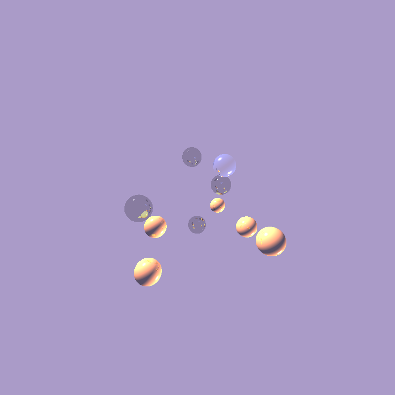
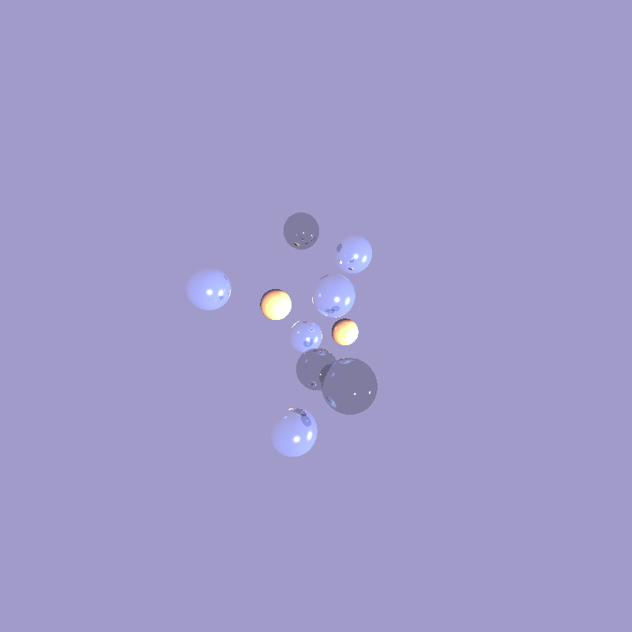
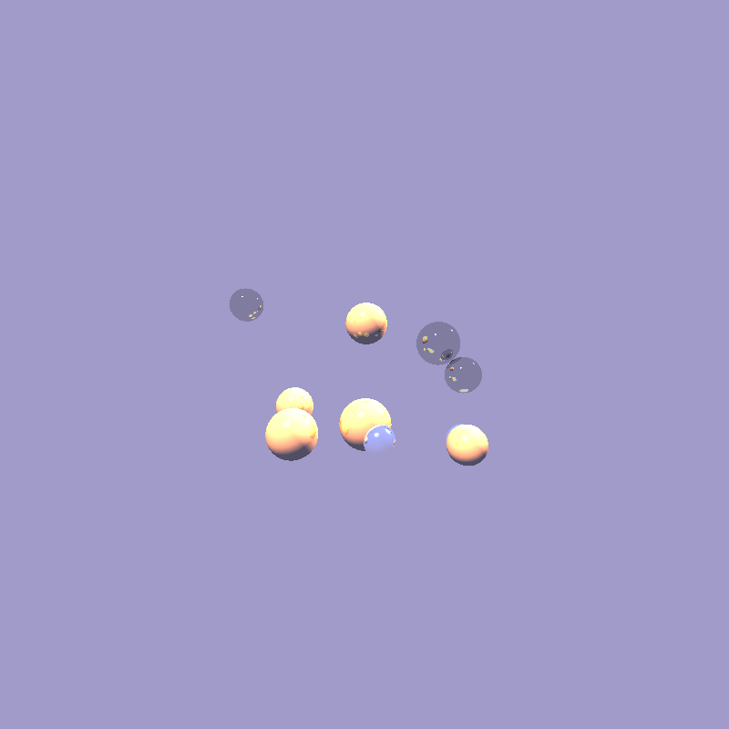
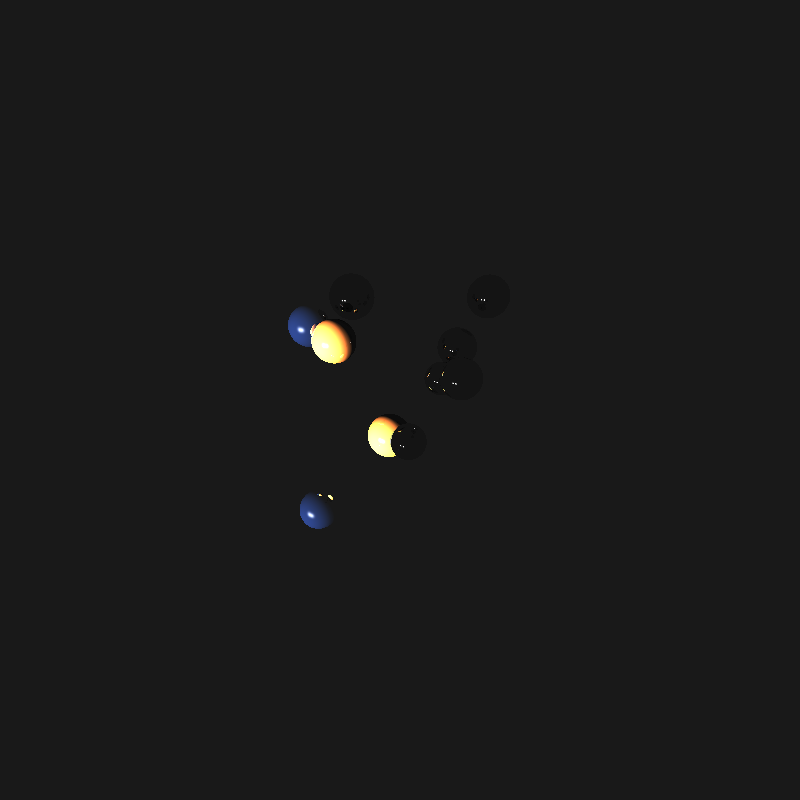

# Лабораторная работа №3 
#### Задача
Реализуйте простой алгоритм трассировки лучей без преломления лучей с помощью GPU. 
Сгенерированная сцена должна состоять из 5-10 сфер разных цветов и 1-2 точечных источников света. 
Максимальная глубина рекурсии - 5.
Все объекты в сцене не прозрачны.

#### Выбор Google Colab для работы
Гугл колаб был выбран альтернативой, потому что на компьютере, на котором производилась работа, нет куды

#### Описание работы программы

Количество сфер (5-10), источников света (1-2) и размер(800×600–1920×1080) задаются в начале кода константно.
В программе были реализованы следующиие функции:

RayTracing вычисляет лучи на GPU.
GenerateSpheres создает параметры для сфер на GPU, используя библиотеку CURAND для генерации случайных чисел. 
GenerateLights создает параметры для источников света на GPU, также с применением CURAND. 
CastRay вычисляет и возвращает итоговый цвет для каждого пикселя. 
SceneIntersect проверяет, произошло ли пересечение луча с объектами в сцене. 
Reflect вычисляет отраженные лучи.
SaveBMP сохраняет картинку в BMP формате.

Результат работы программы - сохраненная картинка со сферами и время работы программы.

#### Результаты

Далее приведены примеры результатов работы программы.

##### Вывод

Столкнулась с тем, что цвет BMP картинки выводился некорректно, был перепутан порядок rgba (bgra). Переписала массив пикселей в из порядка rgba в bgra, как подразумевает BMP формат.
Getting familiar with CUDA applications development and CURAND library.